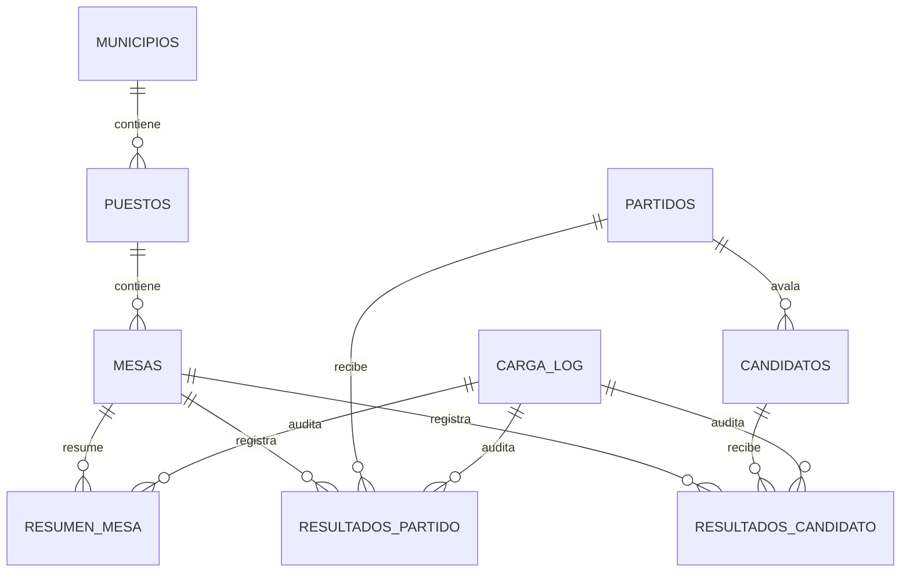

# Schema SQLite - Reto 2.1

## Objetivo

Modelar territorios, partidos, candidatos y resultados por mesa con integridad referencial e idempotencia demostrable. El esquema separa resultados de partido y candidato porque los retos 3.1-3.3 requieren ambos niveles.

## Claves naturales e idempotencia

| Tabla | Restricción `UNIQUE` |
|---|---|
| municipios | `codigo`; `(departamento_codigo, nombre)` |
| puestos | `codigo` |
| mesas | `codigo`; `(puesto_id, numero)` |
| partidos | `(corporacion, codpar)` |
| candidatos | `(partido_id, codcan)` |
| resumen_mesa | `(mesa_id, corporacion)` |
| resultados_partido | `(mesa_id, partido_id)` |
| resultados_candidato | `(mesa_id, candidato_id)` |

Estas restricciones permiten reconocer la misma entidad o resultado al reejecutar. Las FK inválidas no son omitidas por `INSERT OR IGNORE`. Como SQLite sí puede aplicar `IGNORE` a restricciones `NOT NULL` o `CHECK`, el ETL validará campos obligatorios, tipos y rangos antes del insert y contabilizará explícitamente cada fila omitida. `OR IGNORE` no se usará como sustituto de validación.

## Integridad

- `PRAGMA foreign_keys=ON` se activa y comprueba en cada conexión Python.
- IDs territoriales, corporación, códigos y votos esenciales son `NOT NULL`.
- Votos, censo y conteos tienen `CHECK >= 0`.
- Corporación solo admite `CA` o `SE`.
- `carga_log` conserva fuente, ETag, hash, estado y filas leídas/insertadas/omitidas.
- `PRAGMA integrity_check` y `foreign_key_check` forman parte del gate de datos.

## Índices bonus y consulta optimizada

| Índice | Justificación |
|---|---|
| `idx_puestos_municipio` | recorrer puestos para selector/dashboard municipal |
| `idx_partidos_codpar_corporacion` | homologar CA=5 con SE=57 y otros cruces por código |
| `idx_resultados_partido_partido_mesa` | sumar votos de partido por mesa/puesto para arrastre |
| `idx_resultados_candidato_candidato_mesa` | consolidar ranking y atribución por candidato |
| `idx_carga_log_estado_inicio` | diagnosticar cargas fallidas o inconclusas |

No se cuentan como bonus los índices automáticos creados por `PRIMARY KEY` o `UNIQUE`. Una prueba con `EXPLAIN QUERY PLAN` verifica el índice de resultados por partido.

## Decisión de privacidad

La respuesta pública contiene `cedula`, pero el schema no la almacena porque no es necesaria para los retos. Se conservan `codcan`, nombre fuente y nombre normalizado.

## Uso

`db/database.py` inicializa el schema de forma repetible, habilita FK y expone una comprobación de integridad. `db/puestos_2026.db` seguirá sin versionarse si supera el límite indicado por la prueba.
